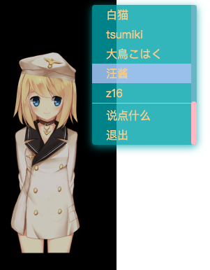

## Intro
live2d简单修改版vue组件...（可选、可拖动、可放大缩小...）  


## TODO
* [ ] 启用dialog后再关闭，请求并未停止...
* [ ] 退出及重新加载的过渡动画、重新加载的位置记忆
* [ ] 客户端设定及记忆

## Demo
⚠ Webpack打包时会出现错误 `window is not defined` 以下demo来自[参考解决方案](https://zhuanlan.zhihu.com/p/36233639)
```
<template>
    <div>
        <live2d />
    </div>
</template>

<script>
export default {
    beforeMount () {
        this.$options.components.live2d = () => import('/path/live2d')
    }    
}
</script>
```

## Memo
* ver 3.1.4

* 安装
```
npm install live2d-widget current-device
```

* 调用
```
import { L2Dwidget as Live2DWidget } from 'live2d-widget/src/index'
```

* 修改
    * `src/config/configMgr.js` **28** 行
        ```
        // defaultsDeep(currConfig, userConfig, defaultConfig);
        defaultsDeep(currConfig, defaultConfig, userConfig);
        ```

    * `src/config/defaultsDeep.js` **16-20** 行
        ```
        /*

        if (val == null) {
          target[key] = value;
        } else if (typeof val === 'object' && val !== null && typeof value === 'object' && value !== null) {
          defaultsDeep(val, value);
        }

        */

        if (typeof val === 'object' && val !== null && typeof value === 'object' && value !== null) {
            defaultsDeep(val, value);
        } else {
            target[key] = value;
        }
        ```

    * `src/lib/live2d.core.js` 注释 **4871-4906** 行

    * 使用 **Webpack** 时（主要是不能混用 import 和 module.exports）
    ```
    // src/config/defaultsDeep.js #3
    // module.exports = function defaultsDeep(target, objects) {
    export function defaultsDeep(target, objects) {

    // src/config/configMgr.js #11
    // import defaultsDeep from './defaultsDeep';
    import { defaultsDeep } from './defaultsDeep';

    // src/dialog/index.js #93
    // module.exports = {
    export {
    ```